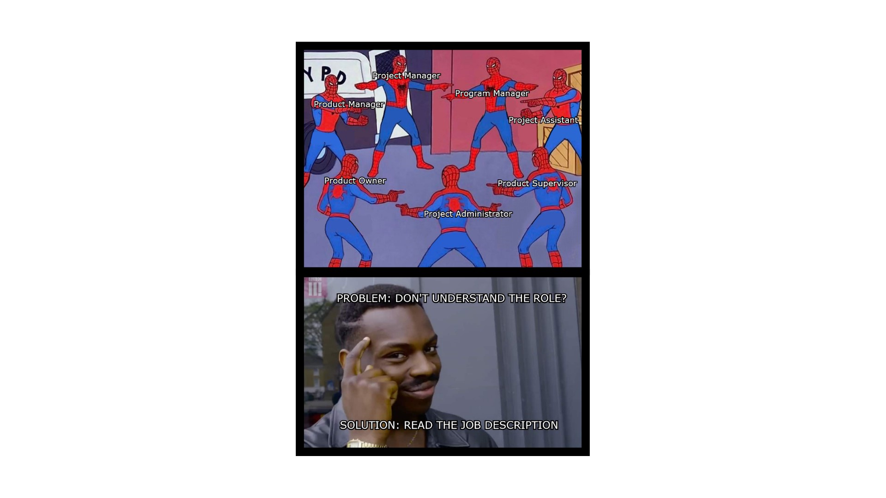

## Tutorial 01
Name: Sophie Vu
ID: 300113938
Email: svu043@uottawa.ca

### Part 01 - List of roles

Research approach: looking up variations of Project , Product , Program  on job boards such as Indeed and LinkedIn. 

Findings:

- Project manager
- Product manager
- Project assistant
- Product supervisor
- Project administrator
- Product owner
- Program manager

### Part 02 - Brainstorm

Research approach: prompting ChatGPT to define each of the following roles and paraphrasing its response.

| Role | Focus | Responsibilities |
| --- | --- | --- |
| Project Manager | Ensure that projects are completed on time, within scope, and on budget. | Project objectives, project plans, allocating resources, managing risks, and overseeing the team. |
| Product Manager | Strategy and development of a product; focus on the product lifecycle. | Prioritizing features and working with cross-functional teams. |
| Program Manager | Oversees multiple related projects or initiatives as a program to ensure alignment with organizational goals. | Provide strategic direction to project managers within the program. |
| Project Assistant | Provide administrative support to project managers and teams. | Documentation, scheduling, communication, and coordination of project |
| Product Supervisor | Overseeing the day-to-day operations of the team. | Guiding the team, monitoring progress, ensuring tasks are completed, and reporting to higher-level managers or product managers. |
| Project Administrator | Oversee administrative tasks related to projects, similar to project assistants but with a more specialized focus. | Budget tracking, resource allocation, documentation, and project communication. |
| Product Owner | Part of Agile development teams and act as the bridge between stakeholders and the development team. | Define user stories, prioritize the backlog, and make decisions on behalf of stakeholders during development. |

### Part 03 - Outline

|  | Screen 01 | Screen 02 |
| --- | --- | --- |
| Image | Multiple Spiderman meme template | Eddie Murphy meme template |
| Text | List of all of the PM variations | Solution to not understanding a role |

### Part 04 - Final

